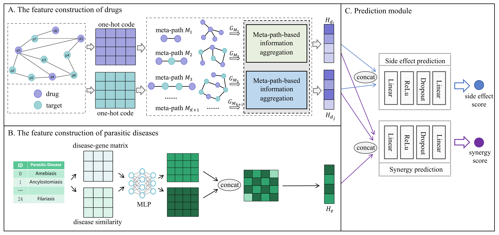

# MetaSynMT
Prediction of Synergistic and Safe Drug Combinations for Parasitic Diseases Via Meta-path Information Aggregation and Multi-task Learning

we propose a novel multi-task learning model, MetaSynMT, based on a meta-path aggregation mechanism to predict synergistic and safe drug combinations.
This mechanism effectively captures drug features by enhancing both structural and high-order semantic representations.
In addition to the primary task of synergy prediction, a side effect prediction task is introduced as an auxiliary task to jointly identify drug combinations with strong synergy and low toxicity.

## Requirements
## Python requirements
⦁	Python >= 3.9
⦁	Pytorch >= 1.10
⦁	dgl >= 11.0

## Usage

Run the model by executing the start_train.py file.
