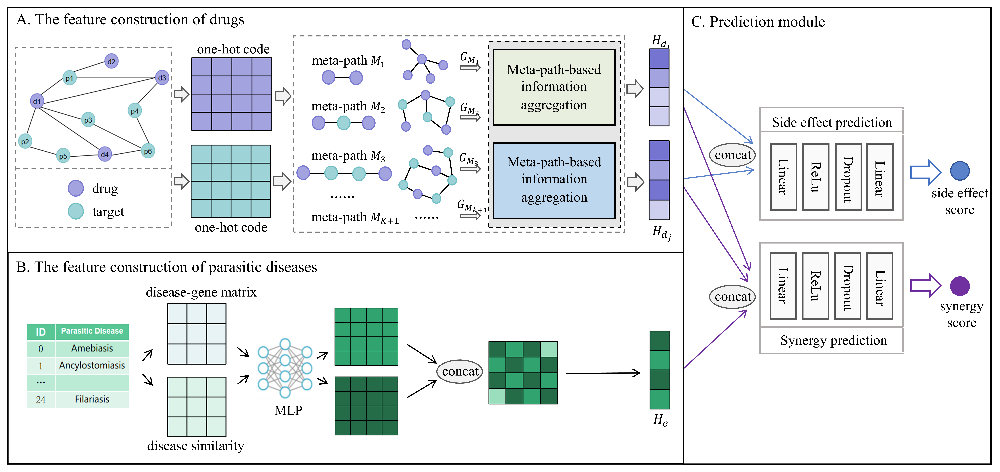

## The MetaSynMT model and tutorial introduction
Prediction of Synergistic and Safe Drug Combinations for Parasitic Diseases Via Meta-path Information Aggregation and Multi-task Learning
we propose a novel multi-task learning model, MetaSynMT, based on a meta-path aggregation mechanism to predict synergistic and safe drug combinations.
This mechanism effectively captures drug features by enhancing both structural and high-order semantic representations.
In addition to the primary task of synergy prediction, a side effect prediction task is introduced as an auxiliary task to jointly identify drug combinations with strong synergy and low toxicity.

Tutorial introduction:
1.Download the MetaSyn.zip file.
2.Configure the conda environment in PyCharm.
3.Install the required packages.
4.Run the end-to-end script file ModelTrain.py to train the model.

## Install Application:
1.Anaconda (https://www.anaconda.com/) 3.Pycharm (https://www.jetbrains.com/pycharm/download/) 2.Git(https://github.com/)

## Packages Requirements
⦁	Python >= 3.9
⦁	Pytorch >= 1.10
⦁	dgl >= 11.0
⦁ sklearn >= 1.0.2
⦁ pandas >= 1.3.5

## Configuration Parameters:
The configuration Settings for hyperparameters and training have been fixed in the training script, including:
⦁ random_seed = 1024 ⦁ drop_out_rate = 0.5 ⦁ learning rate = 0.005 ⦁ weight_decay = 0.001
⦁ hidden-dim = 64 ⦁ num-head = 8 ⦁ epoch = 100 ⦁ batch-size = 32 

## Main Data:
Downloaded data/fold file.
safe_train_val_test_drug_drug_samples.npz: The split result of the benchmark dataset.
safe_train_val_test_drug_drug_labels.npz: The labels of the splited benchmark dataset.
expression_reduced_normalized3.npy: The feature matrix of disease-associated genes.
similar.npy: The similarity feature matrix of diseases.
data/fold/0 : Adjacency list data of different meta-paths.

## End-to-end script
Run the model by executing the ModolTrain.py file to get the results.
